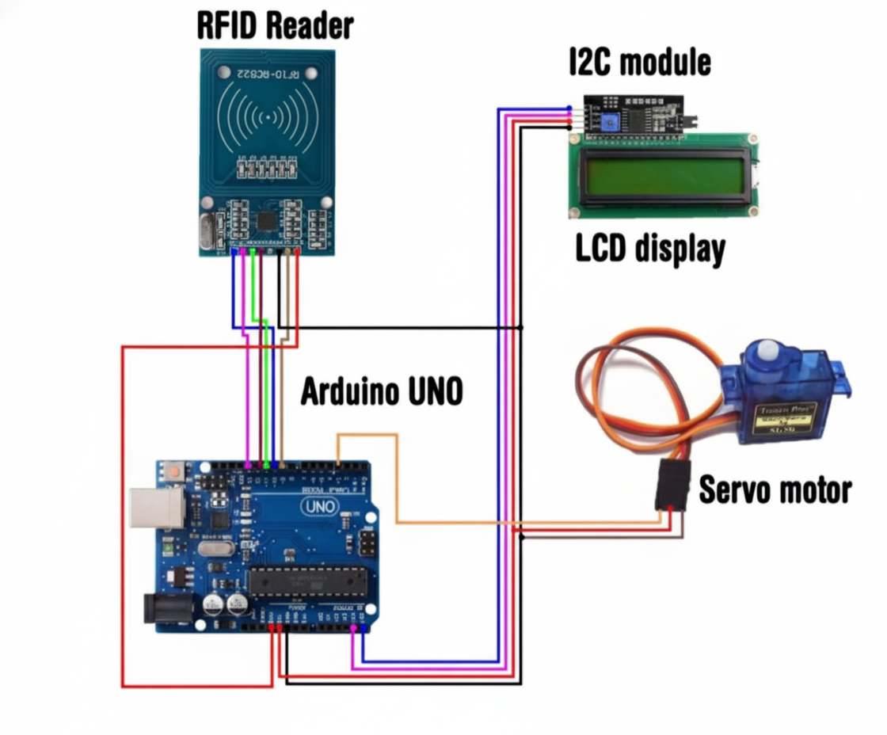
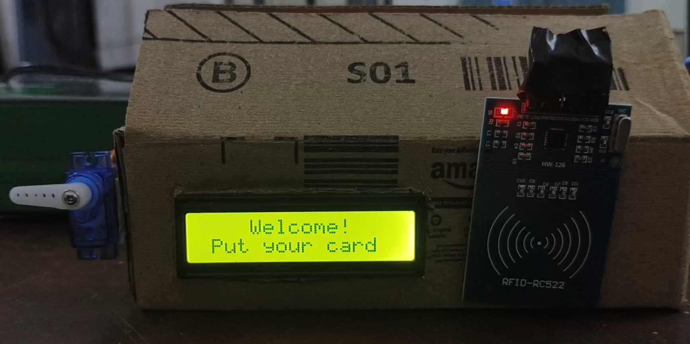
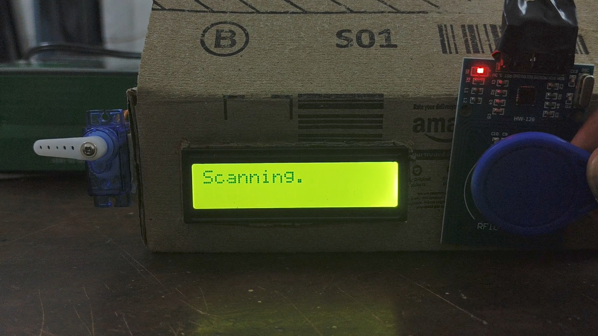
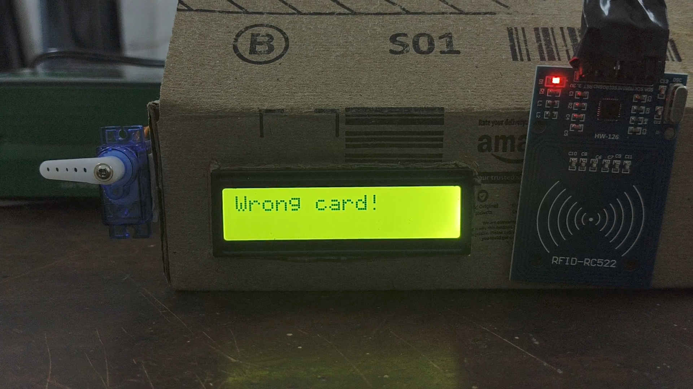
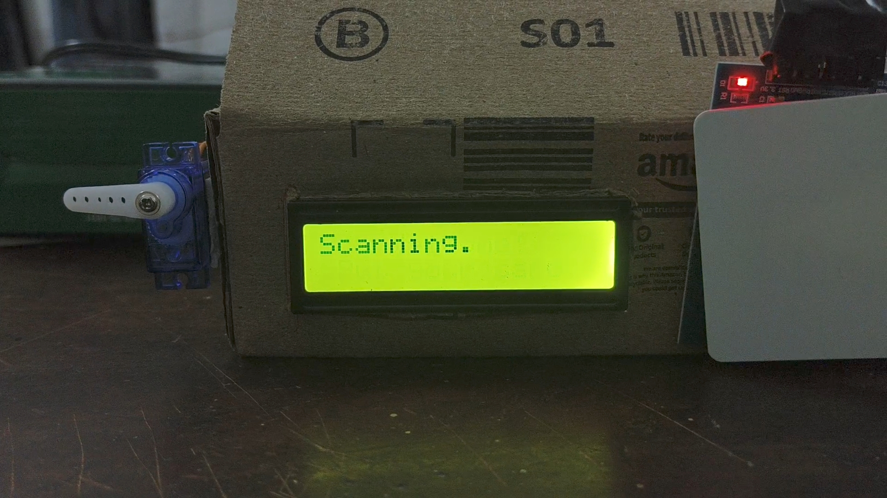
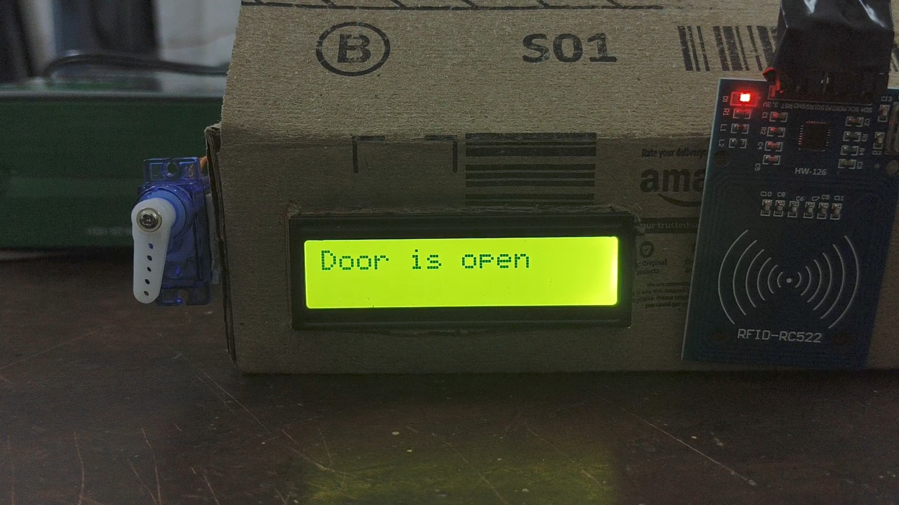

# RFID Door Lock System 🔐
A secure, Arduino-based access control system using RFID technology.

---

## 🚀 Overview
This project uses an **RFID RC522 module** to read card UIDs and a **servo motor** as the locking mechanism.  
An **I2C LCD display** provides real-time feedback like “Access Granted” or “Access Denied”.

It’s built using **Arduino Uno**, showcasing how microcontrollers can be used for simple and practical security systems.

---

## 🧰 Components Used
| Component | Description |
|------------|-------------|
| Arduino Uno | Main microcontroller |
| MFRC522 RFID Module | Reads RFID card/tag UID |
| Servo Motor | Controls door lock mechanism |
| I2C 16x2 LCD | Displays system messages |
| Jumper Wires & Breadboard | For circuit connections |
| RFID Tags / Keycards | Used for authentication |

---

## ⚙️ Circuit Connections
| RFID RC522 Pin | Arduino Pin |
|----------------|-------------|
| VCC | 3.3V |
| GND | GND |
| RST | 9 |
| SDA (SS) | 10 |
| MOSI | 11 |
| MISO | 12 |
| SCK | 13 |

**Servo Motor:** Pin 3  
**LCD Display:** I2C address `0x27`

---

## 💻 Code Setup
1. Open `RFID_DoorLock.ino` in Arduino IDE.  
2. Install these libraries:
   - **MFRC522**
   - **LiquidCrystal_I2C**
   - **Servo**
3. Connect your Arduino Uno and upload the code.
4. Open Serial Monitor (9600 baud rate).
5. Scan your RFID tag — watch the LCD and servo in action!

---

## 🧪 Working
1. System waits for an RFID card to be scanned.  
2. When a tag is detected:
   - ✅ If UID matches the stored authorized tag → **Door unlocks**.  
   - ❌ If UID doesn’t match → **Wrong Card** message is shown.  
3. The LCD provides feedback like:
   - “Door is open”  
   - “Door is locked”  
   - “Wrong card!”

---

## 📷 Demo

Here’s a look at my working RFID door lock prototype:

Here’s a visual overview of the RFID Door Lock System in action.

### 🚫 Unauthorized Access Attempt
When an unregistered card is scanned, the system denies access.

| Step | Description | Image |
|------|--------------|-------|
| 1 | Unauthorized card presented to RFID reader |  |
| 2 | LCD displays “Wrong Card” |  |

---

### ✅ Authorized Access
When a valid RFID tag is scanned, the door unlocks successfully.

| Step | Description | Image |
|------|--------------|-------|
| 1 | Authorized card detected |  |
| 2 | Servo unlocks door – LCD shows “Door is open” |  |

---

These images demonstrate both successful and failed authentication attempts, clearly showing the project’s logic and reliability.